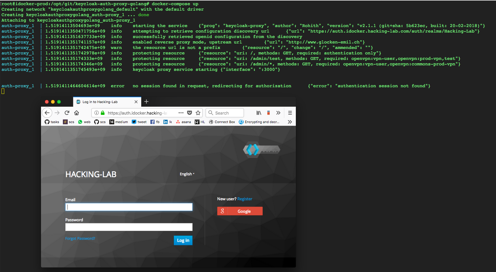
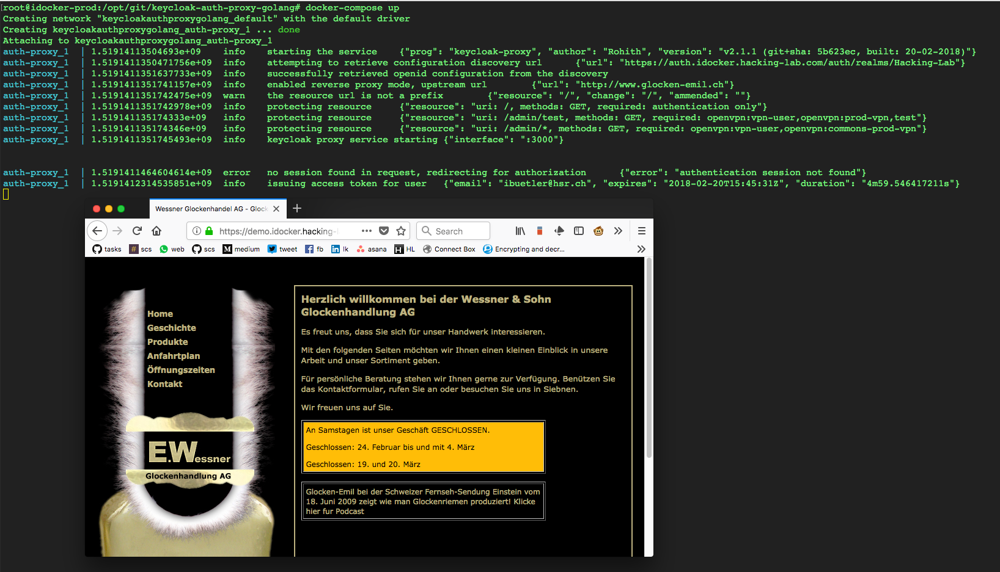

# keycloak-auth-proxy-golang
## Introduction
I am playing around with the keycloak (http://www.keycloak.org/) SSO framework. I want to have a central service for the user registration, password policy, OAuth2, permissions, grants, roles, login via Google, Facebook and more.

I am a RESTful API enthusiast and want to have all important services as APIs available. Thus, the GUI and application logic are properly seperated what allows me to change the GUI very easily if I like to do so. This is important to me, as we have React, Vue.js, Play, Bootstrap and more...

Furthermore, my micro-services and APIs are all **behind** the traefik (https://traefik.io/) load balancer.


## Acknowledgment
The keycloak auth proxy that is being used in this project is maintained by https://github.com/8gears/keycloak-auth-proxy. This guy(s) is/are really responsible for the proxy auth software.

## What is this repo for?
Use the scripts and knowledge in this repo when you want to play around with keycloak auth proxies. Secure your API with roles and grants configured in the keycloak SSO framework.

## First Steps
```
git clone https://github.com/ibuetler/keycloak-auth-proxy-golang.git
cd keycloak-auth-proxy
./create_docker.sh
```

## Configuration
Please adjust the following files for your environment

    ./config
    ./docker-compose.yml

## (A) Run the Proxy with docker-compose
```bash
docker-compose up
```

## (B) Run the Proxy with start_via_traefik.sh
Please adjust the ./start_via_traefik.sh for your needs
```bash
./start_via_traefik.sh
```

## Docker HUB
If you don't want to 'build' the docker image, pls use the following docker hub
* https://hub.docker.com/r/ibuetler/keycloak-auth-proxy-golang/


# Screenshots
## Before SSO Login


## After SSO Login

